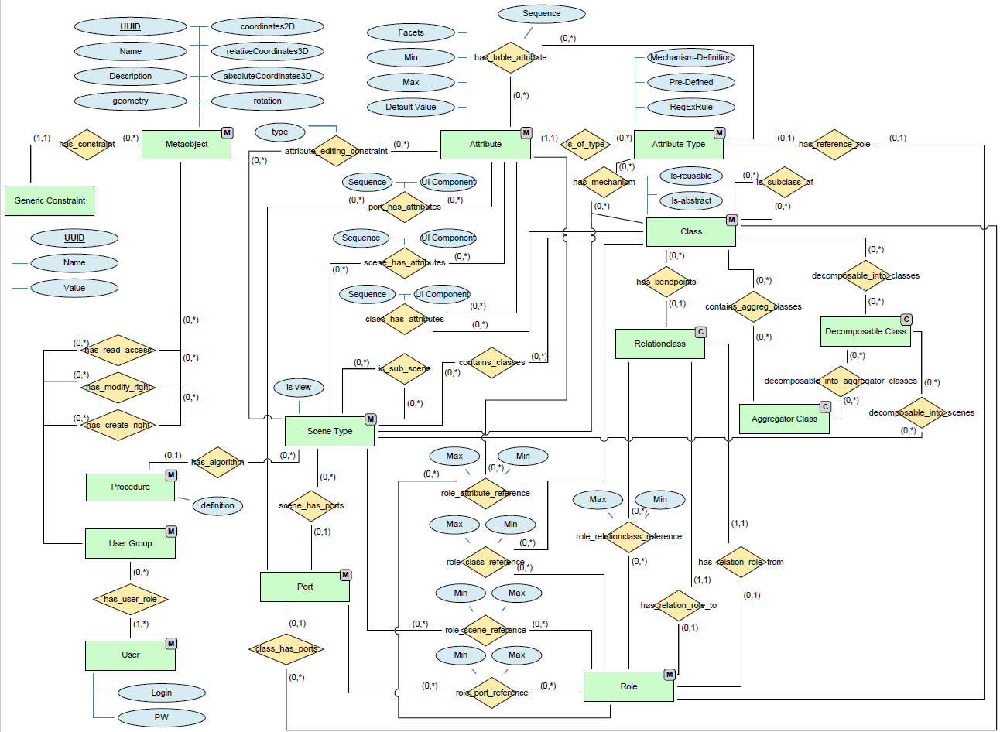
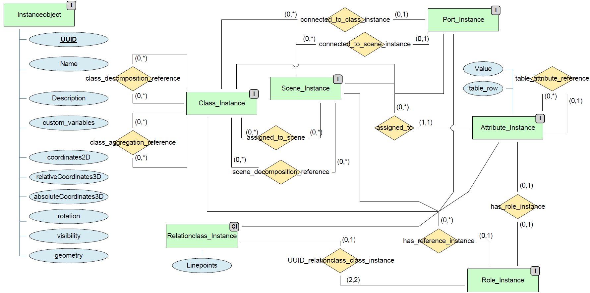
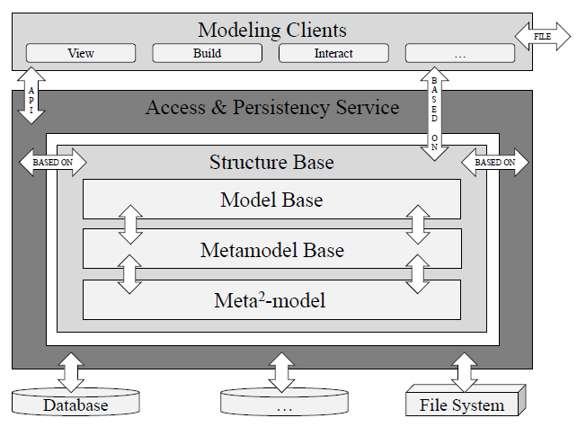
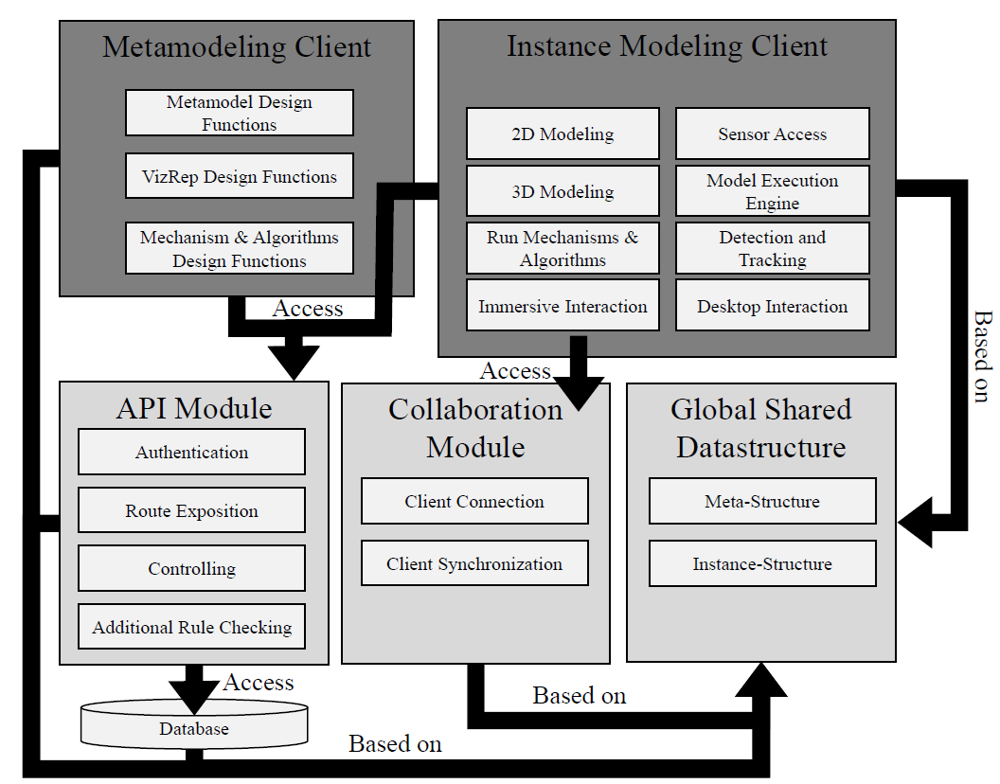
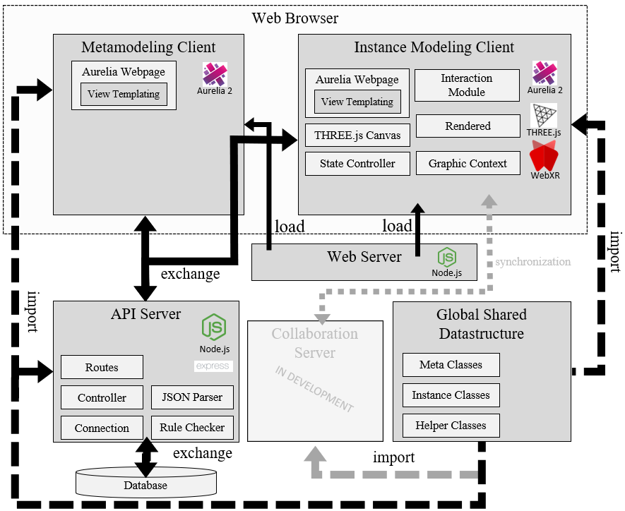
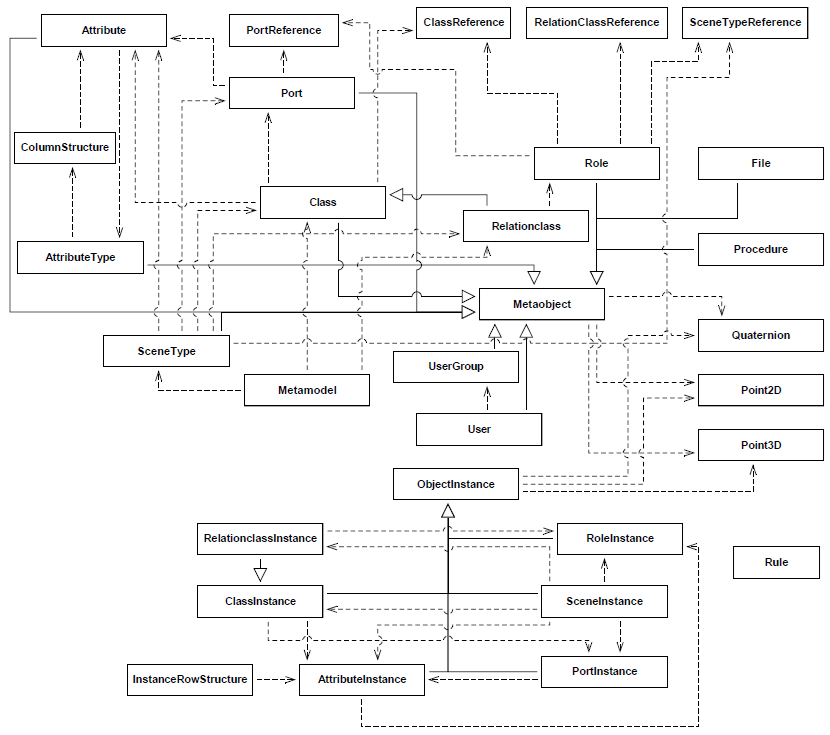
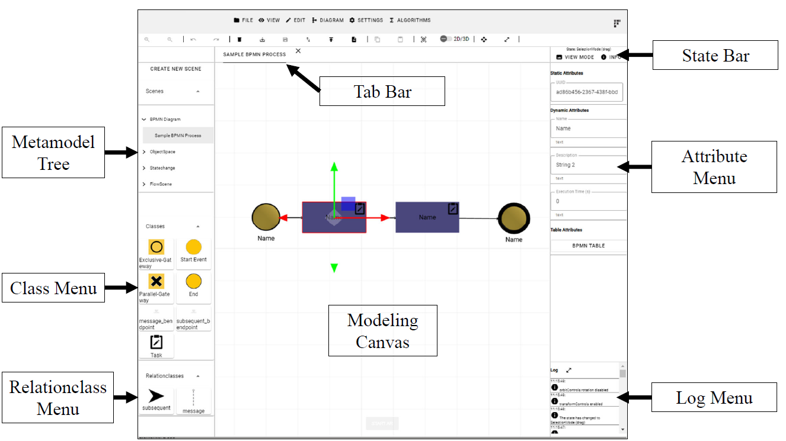
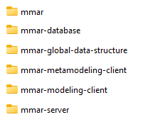
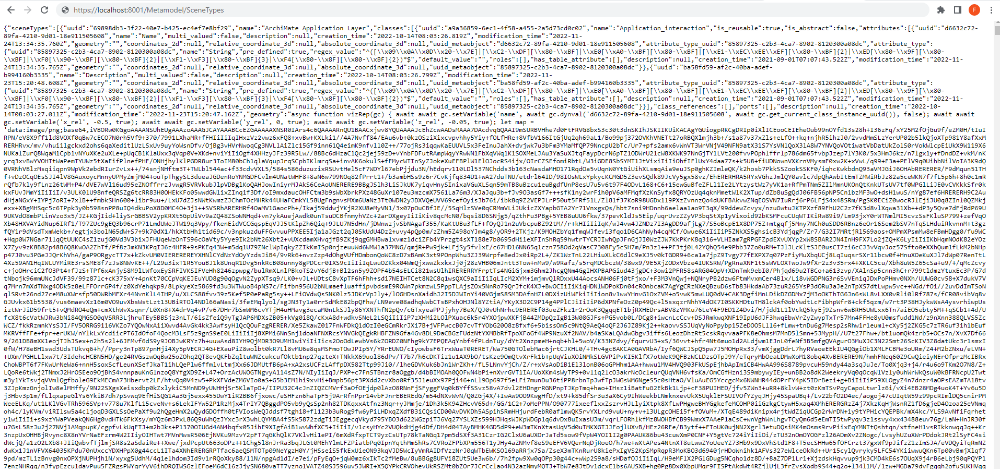

# 1 License Information

This repository is licensed under the GNU AFFERO GENERAL PUBLIC LICENSE Version 3. 

The GNU Affero General Public License (GNU AGPL) is a free, copyleft license published by the Free Software Foundation in November 2007, and based on the GNU GPL version 3 and the Affero General Public License. It is intended for software designed to be run over a network, adding a provision requiring that the corresponding source code of modified versions of the software be prominently offered to all users who interact with the software over a network (https://en.wikipedia.org/wiki/GNU_Affero_General_Public_License).

The GNU AGPL is specifically designed to ensure cooperation with the community in the case of network server software. The licenses for most software are designed to take away your freedom to share and change the works. By contrast, the GNU AGPL is intended to guarantee your freedom to share and change all versions of a program–to make sure it remains free software for all its users (https://www.gnu.org/licenses/agpl-3.0.en.html).

This means that any kind of published change done to the repository must be published again under the same license. For more information have a look at the LICENSE file.

# 2 Meta-Metamodel (Meta<sup>2</sup>-Model)
This project is based on a metamodeling approach. For this purpose we developed a new meta-metamodel that contains new concepts not present in existing meta-metamodels, e.g., supporting concepts for the integration of the 3th dimension, i.e., mixed reality. The meta-metamodel is visible in the two figures below.

The motivation of the project is to create a new metamodeling platform that joins 2D modeling with 3D space and thereby creating an integration into the “metaverse”:


<div> <br> </div>


There is a wiki entry for a more detailed description of the entire meta-metamodel: ([Meta-Metamodel Wiki](https://github.com/MM-AR/mmar/wiki/Meta-Metamodel))


Furthermore, there is a research paper describing the initial concepts of the meta-metamodel: 
- Muff, Fabian, Fill, Hans-Georg (2021): Initial Concepts for Augmented and Virtual Reality-based Enterprise Modeling, in: Lukyanenko, R., Samuel, B., Sturm, A. (2021): Proceedings of the ER Demos and Posters 2021 co-located with 40th International Conference on Conceptual Modeling (ER 2021), CEUR-WS Volume 2958 (https://ceur-ws.org/Vol-2958/paper9.pdf).

For general information on metamodeling look at:
- Karagiannis, D., Kühn, H. (2002). Metamodelling Platforms. In: Bauknecht, K., Tjoa, A.M., Quirchmayr, G. (eds) E-Commerce and Web Technologies. EC-Web 2002. Lecture Notes in Computer Science, vol 2455. Springer, Berlin, Heidelberg. https://doi.org/10.1007/3-540-45705-4_19

- or have a look at the introduction videos on metamodeling:
    - ["Video" -> Metamodleing Foundations](./screenshots/videos/2.1_Metamodeling-Foundations.mp4)
    - ["Video" -> Conceptual Modeling](./screenshots/videos/2.2_Metamodeling-Conceptual_Modeling.mp4)
    - ["Video" -> Language-based Models](./screenshots/videos/2.3_Metamodeling-Language-based_Models.mp4)
    - ["Video" -> Formalization and Pragmatics](./screenshots/videos/2.4_Metamodeling-Formalization_Pragmatics.mp4)
    - ["Video" -> Graphical Representation, Conceptual Models and Modeling Methods](./screenshots/videos/2.5_Metamodeling-Graphical_Representation_Conceptual_Model_Modeling_Methods.mp4)
    - ["Video" -> Metamodeling Definition](./screenshots/videos/2.6_Metamodeling-Metamodeling_Definition.mp4)
 
# 3 Modeling Platform @ UNIFR

## Conceptual Structure

The  Modeling Platform is built after the adapted generic architecture of a Metamodeling Platform according to Karagiannis and Kühn (2002). 

 
<div> <br> </div>

Components of the Modeling Platform:
- There is a new component introduced, denoted as structure base. The structure base contains all the bases, i.e., the meta<sup>2</sup>-model, the metamodel base and the model base.
- Inside the structure base, the meta<sup>2</sup>-model builds the core of the entire metamodeling platform. The meta<sup>2</sup>-model provides the basic concepts to create metamodels and mechanisms. For the sake of comprehensibility, we separated the meta<sup>2</sup>-model into two parts. The meta-layer and the instance layer. Instances of the meta-layer correspond to the metamodel base, while instances of the instance-layer correspond to the model base (see Meta-Metamodel in the previous section).
- Access Services and Persistency Services are core elements of every metamodeling platform. They manage the storage and access of all model and metamodel information. This means that there is a need for services that can handle the storage and the exchange of data to databases, file systems, or other information storage services. As visible in the figure above, we propose a module as access & persistency service that is based on the structure base, i.e., is strictly based on the predefined data structure according to the bases contained. Thus, a state-of-the-art communication
module is needed to provide generic data access and database handling.
- Based on the previously introduced structure base, and the access & persistency service, different modeling clients can be created. These modeling clients can have different purposes, e.g., viewing models, interacting with models, or creating and adapting model instances or metamodels. This includes the definition of modeling methods, including the definition of different language concepts, visual representations, mechanisms, and algorithms, as well as modeling itself.
    - Metamodeling Client: Before it is possible to model conceptual models with the help of a metamodeling platform, it is necessary to define metamodels, i.e., modeling methods. This includes all the aspects introduced in the meta<sup>2</sup>-model.
    - Modeling Client: The modeling activity is the central aspect of every metamodeling platform, in addition to defining metamodels. Instances of conceptual models, i.e. scene instances, can be created on the basis of previously defined metamodels and the introduced
meta<sup>2</sup>-model.

## Specific Structure
The Figure below shows the specific structure of the modeling platform.


<div> <br> </div>

- Global Shared Datastructure: The core of the metamodeling platform is the Global Shared Datastructure module, which corresponds to the structure base introduced above. All other modules visible in the figure above are based on this module, since it defines the data structure that is valid for the entire metamodeling platform.
- Database: Very closely related to the Global Shared Datastructure module is the Database. The Database stores all the metamodel and model instance data according to the meta<sup>2</sup>-model defined in the Global Shared Datastructure.
- API Module: On top of the Database there is an API Module that can access the Database. The API Module exposes different endpoints that are globally accessible by other modules. Further, the API Module handles user authentication, controls data consistency, and checks for additional rules defined in the metamodels.
- Metamodeling Client: The Metamodeling Client Module is also based on the Global Shared Datastructure and uses the exposed endpoints of the API Module to access, modify, or create metamodels.
- Instance Modeling Client: The Instance Modeling Client Module, along with the Metamodeling Client Module, is based on the Global Shared Datastructure. It depends not only on the structure of instances, but also on the meta-structure, i.e., the meta-layer meta<sup>2</sup>-model. For modeling instances, previously defined metamodels are required as a basis. Such metamodels and instances are stored in the Database and can be retrieved to the client from the API Module. In addition, this flexible structure makes it is possible to import metamodels and model instances directly as text files, independent of a database or API.
- Collaboration Module: The Collaboration Module is based on the Global Shared Datastructure module and is accessed from the Instance Modeling Client. The module should be capable of managing connections between various clients and tracking their manipulations of models or model states. Changes made to model instances must be propagated to all connected modeling clients as quickly as possible, preferably in near-real-time. (This is not yet part of the implementation.)


## Technology Stack:
The implementation has been realized as a three-tier architecture system, encompassing a database server with PostgreSQL, an API server running as Node.js application and express, and a client web server running Node.js applications providing browser applications running Aurelia 2 and the JavaScript WebGL visualization framework, THREE.js, in conjunction with the WebXR device API. For all the Node.js applications, we used TypeScript6, a programming language that is strongly typed and builds on JavaScript, providing improved tooling at any scale.

## Implementation Architecture

<div> <br> </div>

- Database (https://github.com/MM-AR/mmar-database): The introduced meta<sup>2</sup>-model has been implemented in a PostgreSQL database. The database is divided into two schemas. The logging schema, which logs every transaction from the metamodeling platform, and the public schema, which holds all the data on the metamodels and model instances. The database not only stores the schema and data itself. It also stores functions for
functionalities that cannot be done using data constraints.
- Global Shared Datastructure (https://github.com/MM-AR/mmar-global-data-structure): The Global Shared Datastructure module is implemented as TypeScript class definitions. The module is not a running program, but only the definition of classes and implements the data structure according to the meta<sup>2</sup>-model. It is separated into two parts. The meta-layer and the instance-layer (see Figure below).
<div> <br> </div>

<div> <br> </div>

- API Server Module (https://github.com/MM-AR/mmar-server): The API server module is implemented as Node.js application using express. The module exposes REST (RESTful) API endpoints. This includes endpoints for POST, GET, PATCH, and DELETE functionalities. In addition, the module defines controller classes and
connection classes for writing to, and retrieving data from the database. The server module also implements middleware services for checking additional rules and for parsing the data into a JSON
format that fits into the Global Shared Datastructure.
- Metamodeling Client (https://github.com/MM-AR/mmar-metamodeling-client): The Metamodeling Client is a Node.js client application that exposes a client website for defining metamodel. The UI of the application is built with the Aurelia 2 framework. Aurelia 2 is a modern JavaScript / TypeScript framework that enables developers to create powerful and efficient applications. It adopts a convention-over-configuration approach and is highly modular and extensible, supporting a range of plugins and customizations. The purpose of the application is to create and manage metamodels, user rights, and additional rules, algorithms and mechanisms related to metamodels.
- Instance Modeling Client (https://github.com/MM-AR/mmar-modeling-client): The Instance Modeling Client is a Node.js client application that exposes a client website for modeling. The UI of the application is built with the Aurelia 2 framework and the
THREE.js 3D framework. The purpose of the client application is to create visual conceptual models based on predefined metamodels. Users can interact with the client to create and manipulate visual conceptual models in traditional 2D and in 3D. The Instance Modeling Clien is based on the Global Shared Datastructure module. Thus, the client
initializes the data structure in a global context and creates and stores metamodels and instance models locally in that data structure. The visualization of these instances in the M2AR Modeler is independent of the instances of the Global Shared Datastructure. Thus, it should be noted that the M2AR Modeler always instantiates two instances for each new instance of the Global Shared Datastructure. (1) The instance of the data structure itself, and (2) a graphical THREE.js instance of the 3D representation according to the VizRep definition defined in the metamodel (see [VizRep](https://github.com/MM-AR/mmar/wiki/VizRep)). The Figure below shows a screenshot of the Instance Modeling Client and its components.
<div> <br> </div>

<div> <br> </div>

- Collaboration Server: The collaboration server is not yet implemented in the metamodeling platform. There have been test implementations to prove the concept. Thus, the collaboration server will be implemented in a client-server approach using the WebSocket protocol for communication between the central server and the connected Instance Modeling Clients.

For a detailed description of the implementation refer to: 
  Muff, F. (2024). Metamodeling for extended reality. Université de Fribourg (Suisse), https://bcufr.swisscovery.slsp.ch/permalink/41SLSP_BCUFR/13cv4r8/alma991019678726805509.


# 4 Installation Instructions
In the following the different parts for installing a running development environment are described.

## 4.1 Install Node Environment

To run the project you must install nodejs (https://nodejs.org/en/) on your machine. If you have problems during the set up of the project, try to update npm and nodejs to a recent version. Further we recommend VSCode or IntelliJ IDEA for your project.
Students can get your free IntelliJ license (https://www.jetbrains.com/de-de/community/education/#students). Then you must clone this repo to your prefered path. You must install typescript (https://www.typescriptlang.org/download) and aurelia (https://aurelia.io/docs/cli/basics#machine-setup) globally in nodejs: Look at the two links above and run the necessary commands.
```
npm install typescript -g
npm install aurelia-cli -g
```

Next you must clone all the required repositories from the project site. 
- https://github.com/MM-AR/mmar-global-data-structure
- https://github.com/MM-AR/mmar-server
- https://github.com/MM-AR/mmar-database
- https://github.com/MM-AR/mmar-modeling-client
- https://github.com/MM-AR/mmar-metamodeling-client
 
```
It is important, that all of these cloned projects are on the same level in the file system. 
We recommend, that you create a parent folder named mmar. In this folder you can then place all project folders related to the mmar project.
```

<div> <br> </div>

Next you must install the project specific node modules. The project contains four separate nodejs projects at the moment.
- https://github.com/MM-AR/mmar-global-data-structure
- https://github.com/MM-AR/mmar-server
- https://github.com/MM-AR/mmar-modeling-client
- https://github.com/MM-AR/mmar-metamodeling-client
 
To install the node dependecies navigate to each folder of the cloned repositories and run the command 
```
npm install
```
 
Each project should now contain a node_modules folder. 
After the initialization of the project folders you can begin to set up your database in the next section.

- ["Video" -> Tutorial: Node Environment Installation](./screenshots/videos/4.1_Install-Node_Environment.mp4)

## 4.2 Set up Database
You have to set up your database for the project. This can be done either locally on your computer, or on a remote server of your choice. The DB system is currently PostgreSQL (https://www.postgresql.org/about/). 

There are two possibiliteis to install the Database for your project, the local DB installation or the DB with Docker (recommended):

### 4.2.1a Docker Image
The recommended approach to install your DB is to run the database in a Docker container. Have a look at the `https://github.com/MM-AR/mmar-database` repository in the root directory. This method does all the schema installation for you. First, you have to install docker on your machine (https://docs.docker.com/get-started/). You can find the instructions for this method in the readme file in the https://github.com/MM-AR/mmar-database repository.

- ["Video" -> Docker Database Set-Up](./screenshots/videos/4.2.b_Set_up_Database_Docker.mp4)

```
!!! Folders in the video are not up to date anymore. This is a seperate repository now. The installation procedure, however, stays similar. 
```

### 4.2.1b Local Database Server installation

If you want to install a local database server on your machine this is the way to go. Keep in mind that there is also the possibility to run a containerized database server using docker (described in the section above). 
For a local intallation download and install your PostgreSQL instance v15 (https://www.postgresql.org/download/).
We recommend to create a superuser with the name "api" and the password "root" to have an easy setup. Be aware, that you should use other credentials, if you work not locally on your machine to ensure that your system is not vulnerable to attackers. PostgreSQL comes with a standard database management tool pgAdmin (https://www.pgadmin.org/). If you prefere another management tool, we recommentd DBeaver (https://dbeaver.io/).
After the installation ther already exists a standard database. We recomment to create a new database called 'api'. You can name it whatever you want, but make sure you keep the name in mind for the next steps.

In the next step we can create the databes schemas for our new database. Usually a new database has a schema called "public". If you are not familiar with PostgreSQL schemas have a look at https://www.postgresql.org/docs/current/ddl-schemas.html.

Now we are ready to install the new schemas containing the table definitions of our meta-metamodel. Before running the script make sure that the database only contains one schema called "public".
To install the latest version of the tables run the following sql script on your newly created database, e.g., in DBeaver (https://dbeaver.com/docs/wiki/SQL-Execution/):

```
mmar\mmar-database\init.sql
```

This should install all the table in the database specified in the meta-metamodel. The standard database should be empty, exept of two entries in metaobject for two standard users and some metaobjects for the standard datatypes.


<!-- ```
!!! Folders in the video are not up to date anymore. This is a seperate repository now. The installation procedure, however, stays similar. 
```
- ["Video" -> Local Database Server installation](./screenshots/videos/4.2.a_Local_Database_Server_installation.mp4) -->


### 4.2.2 Connection Setup for API Server

After the installation of your PostgreSQL database server/container adapt the file `\mmar\mmar-database\config\DBConfig.json` according to your database information. This config file defines the global setting for the express server to connect to the DB.

If the file does not exist, create it according to the following template and name it DBConfig.json
```
{
"user": "api",
"host": "localhost",
"database": "api",
"password": "root",
"port": 5433,
"max": 5,
"idleTimeoutMillis": 3000,
"connectionTimeoutMillis": 2000
}
```

The most important properties here are:
- "user": Make sure the user exists in your database. If you took the recommended name you should have a user called 'api'.
- "host": Normally you must not change that.
- "database": This is the name of your database. Remember your database name? Insert the name here. If you choose the recommendet name you should have a database called 'api'.
- "password": insert here the password of your database user. If you took the recommended approach you should have a user called 'api' with the password 'root'.
- "port": This is the port on which the postgresql DB is exposed. <mark>Make sure to adapt this port accordingly. Standard is 5432. Our Docker DB uses port 5433</mark>.


## 4.3 Start API Server
To start the API server go to your `\mmar\mmar-database` repo and build your project.
Start the Server by running the file: `\mmar\mmar-database\dist\index.js` or by calling `npm run start` in the `\mmar\mmar-database`.
This will start the API-Server. The server is reachable on https://localhost:8001 for https and http://localhost:8000 for http. You can change the ports as you wish in the index.ts file. If you change the ports make sure that you adapt them also in all dependent files.
To test access, call https://localhost:8001/docs/ and https://localhost:8001/metamodel/sceneTypes

### Authentification
The API provides a authentification module. If you want to use the browser API UI on https://yoururl:8001/docs/ page, you have to authenticate first on https://yoururl:8001/login. ([Authentification Wiki](https://github.com/MM-AR/mmar/-/wikis/Authentification))

 ``` 
If you did not install a https certificate on your server you will probably see a security message poping up in your browser when you first call the api webpage. Depending on your browser this message will look different. Make sure that you accept the insecure connection in your browser before you go on with this documentation. Otherwise you will get problems in the next steps. Ask your trusted search engine on how to bypass the invalid certificate warning on your browser. 
 ```

## 4.4 Insert Example Data
If you arrive at this point without any errors you can insert some metamodel data into your database. If you do not want example metamodels in your database just skip this step.
In the folder "\mmar\mmar-database\documentations\example_metamodels" you have multiple .json files for example modeling languages. To insert a modeling language into the database call the API page https://localhost:8001/docs/. This will show you an UI with all the API endpoints available. Copy the JSON content from an example metamodel and open the the API endpoint called `POST /metamodel/sceneTypes`. Click on `Try out` and paste the JSON data into the text field. Hit then the `Execute` button. On successful post, you will get a return 200 code and the whole posted SceneType as return.
```
If you get a "no token provided" message, you forgot to login. -> 'https://yoururl:8001/login' -> default credentials -> user:"admin", password:"admin"
```

<!-- You can further test if your database contains an example metamodel by calling https://localhost:8001/metamodel/sceneTypes.
You should see then a big string in JSON format on your screen like in the image below.

 -->

```
!!! Folders in the video are not up to date anymore. This is a seperate repository now. The procedure, however, stays the same. 
```
- ["Video" -> Insert Example Data](./screenshots/videos/4.4_Insert_Example_Data.mp4)

In the next steps you will learn how to start the Metamodeling Client and the Instance Modeling Client. For the following tasks make sure that the API Server is running and the Database is set-up. Otherwise, you will not be able to use the Metamodeling Client or the Instance Modeling Client.

## 4.5 Start Metamodeling Client
In the `\mmar\mmar-metamodeling-client` run `npm run start`. This will build your package and expose it with webpack to your localhost http://localhost:8070/. Check if you have access to https://localhost:8001/ (api server). Otherwise, the client cannot load the DB content.

In the connection to the DB works, you can sign-in with the button on the upper right corner of the window. You find the credential information in the section "Insert Example Data". As soon as you are signed-in you can work with existing metamodels or create new metamodels for the MMAR client.


## 4.6 Start Instance Modeling Client
In the `\mmar\mmar-modeling-client` run `npm run start`. This will build your package and expose it with webpack to your localhost http://localhost:8080/. Check if you have access to https://localhost:8001/ (api server). Otherwise, the client cannot load the DB content.
Sometimes the browser tells you that it is a insecure connection (invalid certificate warning). In this case you have to allow the connection manually first by calling https://localhost:8001 and by accepting the insecure connection (read section above). 

<mark>Note</mark> that this is only necessary if you work locally on your machine. As soon as you expose the client to the internet, you should use a reverse proxy server, e.g., nginx to redirect secured connections with SSL certificaes to your specific ports, i.e., 8001, 8080, and 8070.

The Instance Modeling Client uses a Sign-In form. You find the credential information in the section "Insert Example Data". Make sure that you change user credentials if you expose the environment in a public network.
After Login you should be able to use the modeling toolkit with the example metamodels loaded in the previous step, or your newly created metamodels. 

<!-- All explanation and instruction videos are available in the folder `screenshots`. -->

# 5 Additional Concepts

## 5.1 VizRep Visual Language
The VizRep is a specialized domain specific language (DSL) designed for the specific purpose of defining the visual representation of all model concepts which are represented visually within a model. 
The VizRep has a predefined set of methods which can be used for the creation of your own visual representations. 

In the modeling tool a clientside TypeScript class handles the translation of these generic methods to the visual representation with the technology of the web client. For the modeling tool shown in this project this is the JavaScript library three.js. However, one could also create other visual translators of the VizRep to other technology stacks. 

For a detailed documentation of the VizRep look at the according wiki page: [VizRep](https://github.com/MM-AR/mmar/wiki/VizRep)

## 5.2 Authentification
The API contains concepts for user managment. A full specification of the authentification is available under [Authentification](https://github.com/MM-AR/mmar/wiki/Authentification)

## 5.3 Expressions
The meta<sup>2</sup>-model allows to use expressions. A full specification of expressions is available under [Expressions](https://github.com/MM-AR/mmar/wiki/Expressions)

# 6 Contribution

We welcome contributions! Please follow these steps:

1. Fork the development branche of the repository you want to work on.
2. Create a new branch (`git checkout -b feature/your-feature`).
3. Commit your changes (`git commit -am 'Add new feature'`).
4. Push to the branch (`git push origin feature/your-feature`).
5. Create a new Pull Request.

Contributions must be documented to be merged into the project. If you contribute something to the project, please document the according changes into the Wiki, or the readme.

# 7 Authors
- Documentation: [Fabian Muff](https://www.unifr.ch/inf/digits/en/group/team/fabian-muff.html) | [Daniel Borcard](https://www.unifr.ch/inf/digits/en/group/team/daniel-borcard.html)
- Meta2Model: [Fabian Muff](https://www.unifr.ch/inf/digits/en/group/team/fabian-muff.html) | [Hans-Georg Fill](https://www.unifr.ch/inf/digits/en/group/team/fill.html) | [Daniel Borcard](https://www.unifr.ch/inf/digits/en/group/team/daniel-borcard.html)
- Instance Modeling Client: [Fabian Muff](https://www.unifr.ch/inf/digits/en/group/team/fabian-muff.html)
- Metamodeling Client: [Daniel Borcard](https://www.unifr.ch/inf/digits/en/group/team/daniel-borcard.html)
- API: [Daniel Borcard](https://www.unifr.ch/inf/digits/en/group/team/daniel-borcard.html) | [Gunakar Challa](https://www.unifr.ch/inf/digits/en/group/team/gunakar-challa.html) | [Fabian Muff](https://www.unifr.ch/inf/digits/en/group/team/fabian-muff.html) 
- GlobalSharedDatastructure: [Fabian Muff](https://www.unifr.ch/inf/digits/en/group/team/fabian-muff.html) | [Daniel Borcard](https://www.unifr.ch/inf/digits/en/group/team/daniel-borcard.html)
