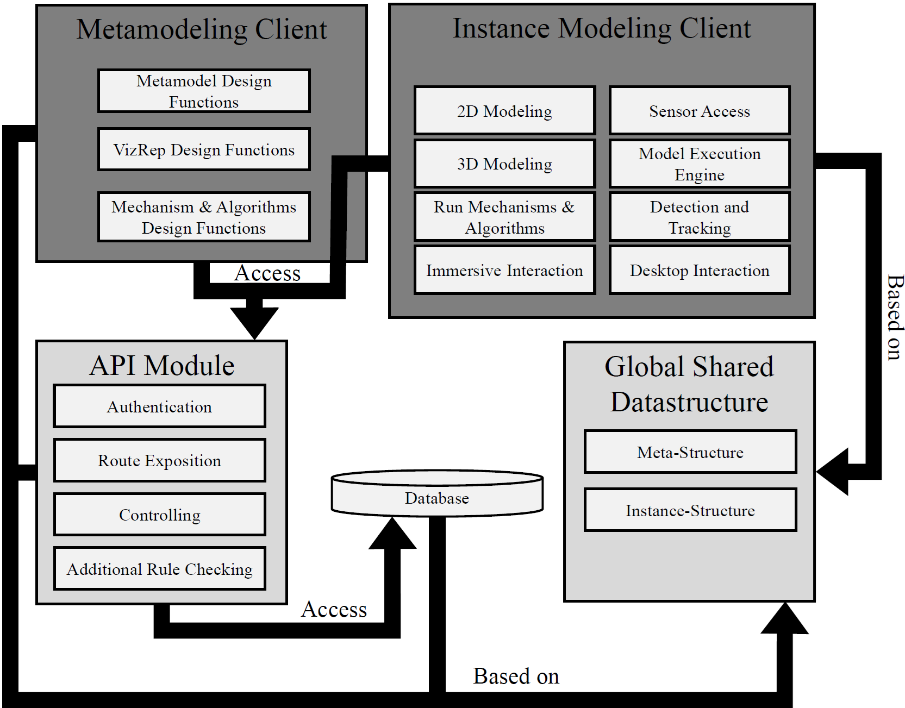

# Table of Contents
1. [License Information](#1-license-information)
2. [Goal Of The Project](#2-goal-of-the-project)
3. [Meta-Metamodel (Meta2-Model)](#3-meta-metamodel-meta2-model)
4. [MM-AR](#4-mm-ar)
   1. [Conceptual Structure](#conceptual-structure)
   2. [Specific Structure](#specific-structure)
   3. [Technology Stack](#technology-stack)
   4. [Implementation Architecture](#implementation-architecture)
5. [Installation Instructions](#5-installation-instructions)
   1. [Docker all in one Installation](#51-docker-all-in-one-installation)
   2. [Manual Installation](#52-manual-installation)
6. [Additional Concepts](#6-additional-concepts)
   1. [VizRep Visual Language](#61-vizrep-visual-language)
   2. [Authentication](#62-authentication)
   3. [Expressions](#63-expressions)
7. [Contribution](#7-contribution)
8. [Authors](#8-authors)

# 1 License Information

This repository is licensed under the GNU AFFERO GENERAL PUBLIC LICENSE Version 3. 

The GNU Affero General Public License (GNU AGPL) is a free, copyleft license published by the Free Software Foundation in November 2007, and based on the GNU GPL version 3 and the Affero General Public License. It is intended for software designed to be run over a network, adding a provision requiring that the corresponding source code of modified versions of the software be prominently offered to all users who interact with the software over a network (https://en.wikipedia.org/wiki/GNU_Affero_General_Public_License).

The GNU AGPL is specifically designed to ensure cooperation with the community in the case of network server software. The licenses for most software are designed to take away your freedom to share and change the works. By contrast, the GNU AGPL is intended to guarantee your freedom to share and change all versions of a program–to make sure it remains free software for all its users (https://www.gnu.org/licenses/agpl-3.0.en.html).

This means that any kind of published change done to the repository must be published again under the same license. For more information have a look at the LICENSE file.

# 2 Goal Of The Project
State-of-the-art metamodeling tools only consider two-dimensional space. However, the real world is three-dimensional and thus, there should be a way to use the third dimension in modeling as well. Since there is no metamodeling tools allowing for 3D modeling, we developed a new metamodeling platform, denoted as MMAR.
MMAR is a web-based, two- and three-dimensional metamodeling environment that enables the definition of 2D and 3D modeling languages, as well as the modeling and processing of models.

# 3 Meta-Metamodel (Meta2-Model)
This project is based on a metamodeling approach. For this purpose we developed a new meta-metamodel that contains new concepts not present in existing meta-metamodels, e.g., supporting concepts for the integration of the 3th dimension, i.e., mixed reality. The meta-metamodel is visible in the two figures below.

   

There is a wiki entry for a more detailed description of the entire meta-metamodel: ([Meta-Metamodel Wiki](https://github.com/MM-AR/mmar/wiki/Meta-Metamodel))

Furthermore, there is a research paper describing the initial concepts of the meta-metamodel: 
- Muff, Fabian, Fill, Hans-Georg (2021): Initial Concepts for Augmented and Virtual Reality-based Enterprise Modeling, in: Lukyanenko, R., Samuel, B., Sturm, A. (2021): Proceedings of the ER Demos and Posters 2021 co-located with 40th International Conference on Conceptual Modeling (ER 2021), CEUR-WS Volume 2958 (https://ceur-ws.org/Vol-2958/paper9.pdf).

For general information on metamodeling look at:
- Karagiannis, D., Kühn, H. (2002). Metamodelling Platforms. In: Bauknecht, K., Tjoa, A.M., Quirchmayr, G. (eds) E-Commerce and Web Technologies. EC-Web 2002. Lecture Notes in Computer Science, vol 2455. Springer, Berlin, Heidelberg. https://doi.org/10.1007/3-540-45705-4_19

- or have a look at the introduction videos on metamodeling:
    - ["Video" -> Metamodeling Foundations](./screenshots/videos/2.1_Metamodeling-Foundations.mp4)
    - ["Video" -> Conceptual Modeling](./screenshots/videos/2.2_Metamodeling-Conceptual_Modeling.mp4)
    - ["Video" -> Language-based Models](./screenshots/videos/2.3_Metamodeling-Language-based_Models.mp4)
    - ["Video" -> Formalization and Pragmatics](./screenshots/videos/2.4_Metamodeling-Formalization_Pragmatics.mp4)
    - ["Video" -> Graphical Representation, Conceptual Models and Modeling Methods](./screenshots/videos/2.5_Metamodeling-Graphical_Representation_Conceptual_Model_Modeling_Methods.mp4)
    - ["Video" -> Metamodeling Definition](./screenshots/videos/2.6_Metamodeling-Metamodeling_Definition.mp4)
 
# 4 MM-AR
Below, the structure of the metamodeling platform, as well as the used technology stack are introduced.
## Conceptual Structure

The  Modeling Platform is built after the adapted generic architecture of a Metamodeling Platform according to Karagiannis and Kühn (2002). 

 

   

Components of the Modeling Platform:
- There is a new component introduced, denoted as structure base. The structure base contains all the bases, i.e., the meta2-model, the metamodel base and the model base.
- Inside the structure base, the meta2-model builds the core of the entire metamodeling platform. The meta2-model provides the basic concepts to create metamodels and mechanisms. For the sake of comprehensibility, we separated the meta2-model into two parts. The meta-layer and the instance layer. Instances of the meta-layer correspond to the metamodel base, while instances of the instance-layer correspond to the model base (see Meta-Metamodel in the previous section).
- Access Services and Persistency Services are core elements of every metamodeling platform. They manage the storage and access of all model and metamodel information. This means that there is a need for services that can handle the storage and the exchange of data to databases, file systems, or other information storage services. As visible in the figure above, we propose a module as access & persistency service that is based on the structure base, i.e., is strictly based on the predefined data structure according to the bases contained. Thus, a state-of-the-art communication
module is needed to provide generic data access and database handling.
- Based on the previously introduced structure base, and the access & persistency service, different modeling clients can be created. These modeling clients can have different purposes, e.g., viewing models, interacting with models, or creating and adapting model instances or metamodels. This includes the definition of modeling methods, including the definition of different language concepts, visual representations, mechanisms, and algorithms, as well as modeling itself.
    - Metamodeling Client: Before it is possible to model conceptual models with the help of a metamodeling platform, it is necessary to define metamodels, i.e., modeling methods. This includes all the aspects introduced in the meta2-model.
    - Modeling Client: The modeling activity is the central aspect of every metamodeling platform, in addition to defining metamodels. Instances of conceptual models, i.e. scene instances, can be created on the basis of previously defined metamodels and the introduced
meta2-model.

## Specific Structure
The Figure below shows the specific structure of the modeling platform.

   

- Global Shared Datastructure: The core of the metamodeling platform is the Global Shared Datastructure module, which corresponds to the structure base introduced above. All other modules visible in the figure above are based on this module, since it defines the data structure that is valid for the entire metamodeling platform.
- Database: Very closely related to the Global Shared Datastructure module is the Database. The Database stores all the metamodel and model instance data according to the meta2-model defined in the Global Shared Datastructure.
- API Module: On top of the Database there is an API Module that can access the Database. The API Module exposes different endpoints that are globally accessible by other modules. Further, the API Module handles user authentication, controls data consistency, and checks for additional rules defined in the metamodels.
- Metamodeling Client: The Metamodeling Client Module is also based on the Global Shared Datastructure and uses the exposed endpoints of the API Module to access, modify, or create metamodels.
- Modeling Client: The Modeling Client Module, along with the Metamodeling Client Module, is based on the Global Shared Datastructure. It depends not only on the structure of instances, but also on the meta-structure, i.e., the meta-layer meta2-model. For modeling instances, previously defined metamodels are required as a basis. Such metamodels and instances are stored in the Database and can be retrieved to the client from the API Module. In addition, this flexible structure makes it is possible to import metamodels and model instances directly as text files, independent of a database or API.

## Technology Stack:
The implementation has been realized as a three-tier architecture system, encompassing a database server with PostgreSQL, an API server running as Node.js application and express, and a client web server running Node.js applications providing browser applications running Aurelia 2 and the JavaScript WebGL visualization framework, THREE.js, in conjunction with the WebXR device API. For all the Node.js applications, we used TypeScript, a programming language that is strongly typed and builds on JavaScript, providing improved tooling at any scale.

## Implementation Architecture

   

- Database (https://github.com/MM-AR/mmar-database): The introduced meta2-model has been implemented in a PostgreSQL database. The database is divided into two schemas. The logging schema, which logs every transaction from the metamodeling platform, and the public schema, which holds all the data on the metamodels and model instances. The database not only stores the schema and data itself. It also stores functions for
functionalities that cannot be done using data constraints.
- Global Shared Datastructure (https://github.com/MM-AR/mmar-global-data-structure): The Global Shared Datastructure module is implemented as TypeScript class definitions. The module is not a running program, but only the definition of classes and implements the data structure according to the meta2-model. It is separated into two parts. The meta-layer and the instance-layer (see Figure below).

   

   

- API Server Module (https://github.com/MM-AR/mmar-server): The API server module is implemented as Node.js application using express. The module exposes REST (RESTful) API endpoints. This includes endpoints for POST, GET, PATCH, and DELETE functionalities. In addition, the module defines controller classes and
connection classes for writing to, and retrieving data from the database. The server module also implements middleware services for checking additional rules and for parsing the data into a JSON
format that fits into the Global Shared Datastructure.
- Metamodeling Client (https://github.com/MM-AR/mmar-metamodeling-client): The Metamodeling Client is a Node.js client application that exposes a client website for defining metamodel. The UI of the application is built with the Aurelia 2 framework. Aurelia 2 is a modern JavaScript / TypeScript framework that enables developers to create powerful and efficient applications. It adopts a convention-over-configuration approach and is highly modular and extensible, supporting a range of plugins and customizations. The purpose of the application is to create and manage metamodels, user rights, and additional rules, algorithms and mechanisms related to metamodels.
- Modeling Client (https://github.com/MM-AR/mmar-modeling-client): The Modeling Client is a Node.js client application that exposes a client website for modeling. The UI of the application is built with the Aurelia 2 framework and the
THREE.js 3D framework. The purpose of the client application is to create visual conceptual models based on predefined metamodels. Users can interact with the client to create and manipulate visual conceptual models in traditional 2D and in 3D. The Instance Modeling Clien is based on the Global Shared Datastructure module. Thus, the client
initializes the data structure in a global context and creates and stores metamodels and instance models locally in that data structure. The visualization of these instances in the M2AR Modeler is independent of the instances of the Global Shared Datastructure. Thus, it should be noted that the M2AR Modeler always instantiates two instances for each new instance of the Global Shared Datastructure. (1) The instance of the data structure itself, and (2) a graphical THREE.js instance of the 3D representation according to the VizRep definition defined in the metamodel (see [VizRep](https://github.com/MM-AR/mmar/wiki/VizRep)). The Figure below shows a screenshot of the Modeling Client and its components.

   

   

For a detailed description of the implementation refer to: 
  Muff, F. (2024). Metamodeling for extended reality. https://link.springer.com/book/9783031767616

# 5 Installation Instructions
In the following the different parts for installing a running production or development environment are described.

## 5.1 Docker all in one Installation
To facilitate the installation of MMAR, you can install the entire environment in development or production mode via docker in a single script installation. We strongly recommend using this method for your installation, since installation problems can be minimized like that. For detailed instructions visit https://github.com/MM-AR/mmar-docker-installation

## 5.2 Manual Installation
It is also possible to install all the parts separately. 
For the manual installation have a look at the wiki Entry: [Manual MMAR Intstallation](https://github.com/MM-AR/mmar/wiki/Manual-MMAR-Installation)

# 6 Additional Concepts

## 6.1 VizRep Visual Language
The VizRep is a specialized domain specific language (DSL) designed for the specific purpose of defining the visual representation of all model concepts which are represented visually within a model. 
The VizRep has a predefined set of methods which can be used for the creation of your own visual representations. 

In the modeling tool a clientside TypeScript class handles the translation of these generic methods to the visual representation with the technology of the web client. For the modeling tool shown in this project this is the JavaScript library three.js. However, one could also create other visual translators of the VizRep to other technology stacks. 

For a detailed documentation of the VizRep look at the according wiki page: [VizRep](https://github.com/MM-AR/mmar/wiki/VizRep)

## 6.2 Authentication
The API contains concepts for user managment. A full specification of the authentication is available under [Authentication](https://github.com/MM-AR/mmar/wiki/Authentication)

## 6.3 Expressions
The meta2-model allows to use expressions. A full specification of expressions is available under [Expressions](https://github.com/MM-AR/mmar/wiki/Expressions)

# 7 Contribution

We welcome contributions! Please follow these steps:

1. Fork the development branche of the repository you want to work on.
2. Create a new branch (`git checkout -b feature/your-feature`).
3. Commit your changes (`git commit -am 'Add new feature'`).
4. Push to the branch (`git push origin feature/your-feature`).
5. Create a new Pull Request.

Contributions must be documented to be merged into the project. If you contribute something to the project, please document the according changes into the Wiki, or the readme.

# 8 Authors
- Documentation: [Fabian Muff](https://www.unifr.ch/inf/digits/en/group/team/fabian-muff.html) | [Daniel Borcard](https://www.unifr.ch/inf/digits/en/group/team/daniel-borcard.html)
- Meta2Model: [Fabian Muff](https://www.unifr.ch/inf/digits/en/group/team/fabian-muff.html) | [Hans-Georg Fill](https://www.unifr.ch/inf/digits/en/group/team/fill.html) | [Daniel Borcard](https://www.unifr.ch/inf/digits/en/group/team/daniel-borcard.html)
- Modeling Client: [Fabian Muff](https://www.unifr.ch/inf/digits/en/group/team/fabian-muff.html)
- Metamodeling Client: [Daniel Borcard](https://www.unifr.ch/inf/digits/en/group/team/daniel-borcard.html)
- API: [Daniel Borcard](https://www.unifr.ch/inf/digits/en/group/team/daniel-borcard.html) | [Gunakar Challa](https://www.unifr.ch/inf/digits/en/group/team/gunakar-challa.html) | [Fabian Muff](https://www.unifr.ch/inf/digits/en/group/team/fabian-muff.html) 
- GlobalSharedDatastructure: [Fabian Muff](https://www.unifr.ch/inf/digits/en/group/team/fabian-muff.html) | [Daniel Borcard](https://www.unifr.ch/inf/digits/en/group/team/daniel-borcard.html)
- Docker Installation: [Fabian Muff](https://www.unifr.ch/inf/digits/en/group/team/fabian-muff.html)
